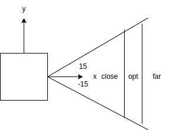

# Project 2 - Task 1

## Description

In this project I have implemented a simple wall following algorithm using the triton sobot and Q-Table. The Q-Table is in the `scripts/wf_param.py` file. It is a $3\times3$ matrix containg 3 states and 3 actions.
The states are the average distange from the right wall. It is divided into 3 ranges which are `close`, `optimal` and `far`. The actions are on the angular velocity of the robot along the z-axis. The actions are 3 values for the angular velocity which are `-15 deg/s`, `0 deg/s` and `15 deg/s`. The Q-Table is arbitararily initialized to take the best actions based on the states that the agent is observing from its LasrScan sensor.



## code explanation

The code is divided into 2 files:

1. `wall_follower_run.py` is the main file that is used to initialize the node and follow the path.
2. `wf_param.py` is the file that contains the Q-Table and the states and actions.

## How to run the code

1. copy the package to `catkin_ws/src` folder
2. Run the following commands in the terminal

```bash
cd ~/catkin_ws
catkin_make
source /opt/ros/noetic/setup.bash
source ~/catkin_ws/devel/setup.bash
roscd stingray_sim
```

3. Run the following command to start the turtlesim

```bash
roslaunch stingray_sim wall_following.launch 
```

The Robot will spawn at `(3,-3)` and follows along the wall.
# wall-following-triton
# wall-following-triton
# wall-following-triton
